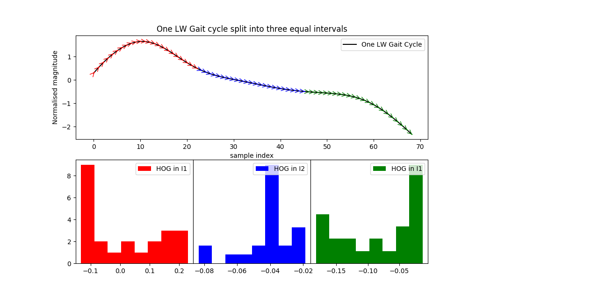

# HOG1D
Implementation of Histogram of Gradients for Time Series classification

We have the foot-ground angle data from various subjects collected from a novel instrument that we developed. The data has been collected during three walking modes: Level Walk (LW), Ramp Ascent (RA) and Ramp Descent (RD).

This repository contains our implementation of Histogram of Gradients (HOG) for these 1-D time series. The script creates a data file in CSV format which was later used to classify the signals using a Support Vector Machine.

Some images:

Axis 1 shows the oriented gradients for one enitre gait cycle in LW. Axis 2 shows the corresponding HOG by splitting one gait cycle into 3 equal parts.

Axis 1 shows the oriented gradients for one enitre gait cycle in RA. Axis 2 shows the corresponding HOG by splitting one gait cycle into 3 equal parts.

Axis 1 shows the oriented gradients for one enitre gait cycle in RD. Axis 2 shows the corresponding HOG by splitting one gait cycle into 3 equal parts.
